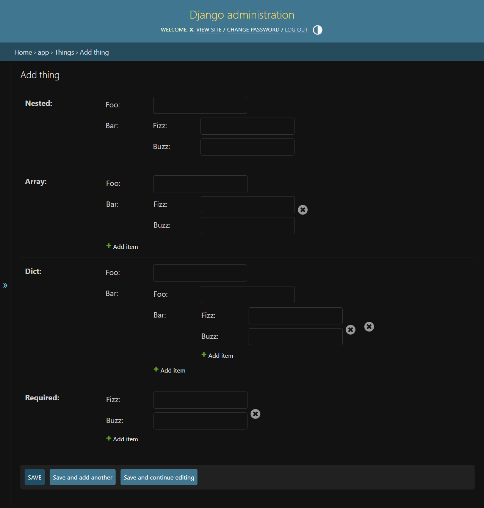
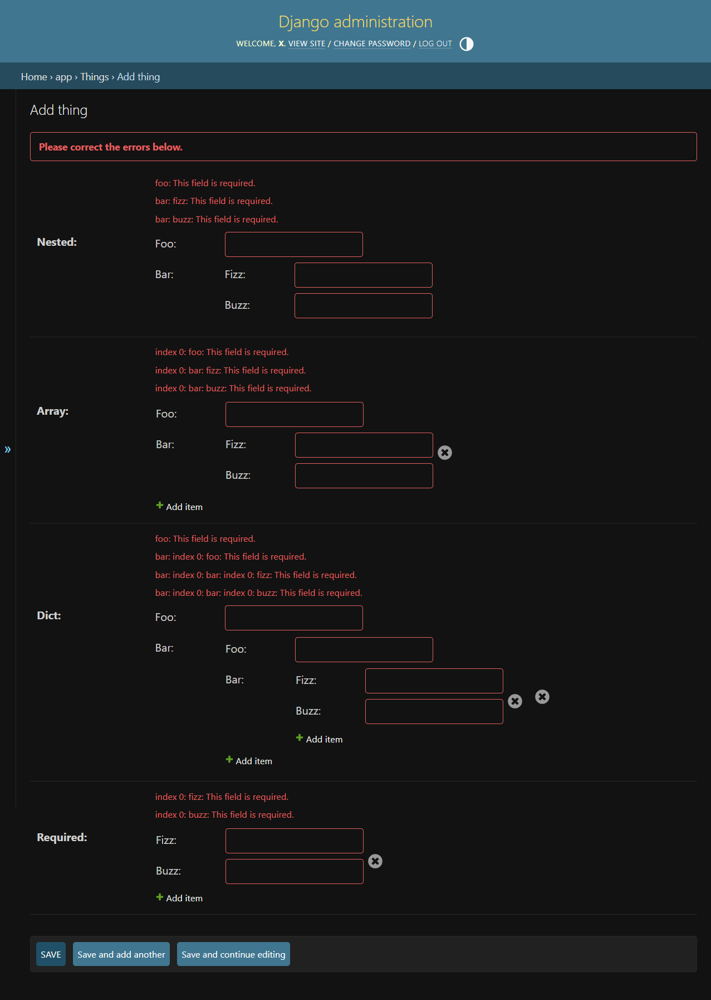

# Example

Given the following model:

```python
from django.db import models

class Thing(models.Model):
    nested = models.JSONField(default=dict)
    array = models.JSONField(default=list)
```

We can create the following ModelAdmin

```python
from django.contrib import admin
from myapp.models import Thing

@admin.register(Thing)
class AdminThing(admin.ModelAdmin):
    pass
```

We can add a custom form to it using the nested form to it using
`NestedFormField` and `DynamicArrayField`.

```python
from django import forms
from subforms.fields import DynamicArrayField, NestedFormField

class FizzBuzzForm(forms.Form):
    fizz = forms.CharField()
    buzz = forms.IntegerField()

class ExampleForm(forms.Form):
    foo = forms.CharField()
    bar = NestedFormField(subform=FizzBuzzForm)

class ThingForm(forms.ModelForm):

    nested = NestedFormField(subform=ExampleForm)
    array = DynamicArrayField(subfield=NestedFormField(subform=ExampleForm))

    class Meta:
        model = Thing
        fields = [
            "nested",
            "array",
        ]
```

This will create the following form in the admin panel:



And the data will be saved in the following from:

```python
thing = {
    "nested": {
        "foo": "1",
        "bar": {
            "fizz": "2",
            "buzz": 3,
        },
    },
    "array": [
        {
            "foo": "4",
            "bar": {
                "fizz": "5",
                "buzz": 6,
            },
        },
        {
            "foo": "7",
            "bar": {
                "fizz": "8",
                "buzz": 9,
            },
        },
    ],
}
```

The nested forms will validate each of the fields, and errors
will be shown like this:



> Note, that currently you cannot nest `DynamicArrayField` inside a
> `DynamicArrayField`. If you do, you are only able to add one subitem
> per parent item, and the rest of the items will be treated as if they
> were added to additional parent items. This is likely not the behavior
> you want, but I currently don't have a solution for this. Pull request
> are welcome!
